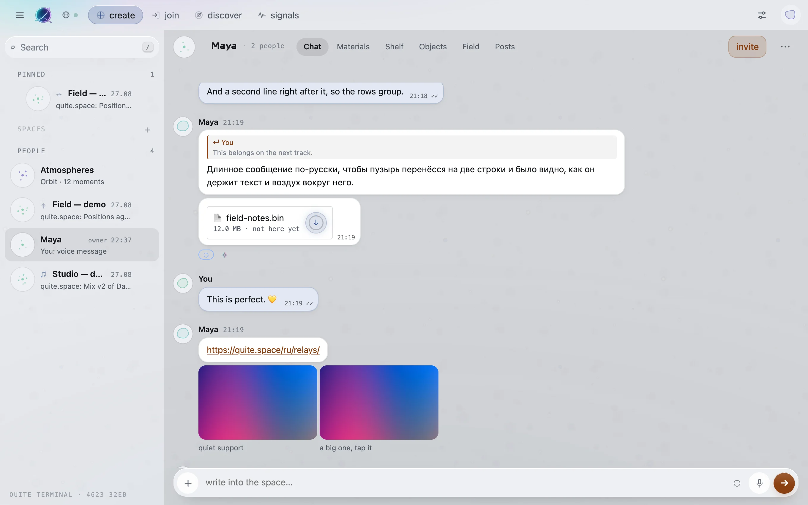
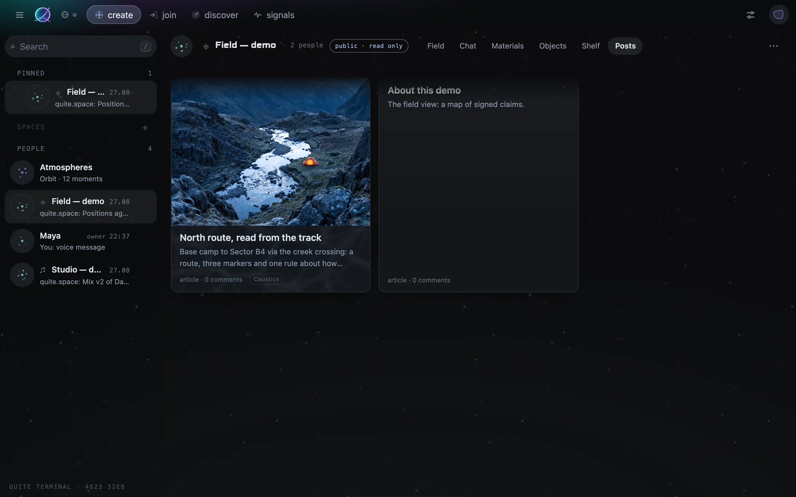
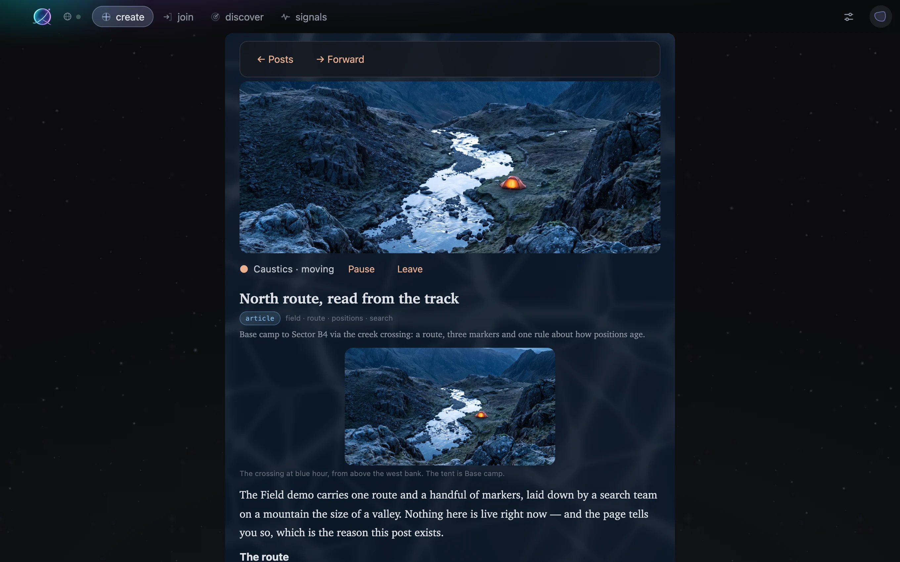
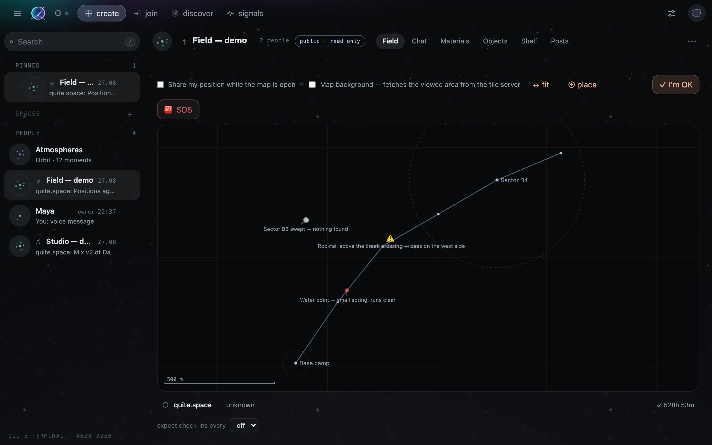
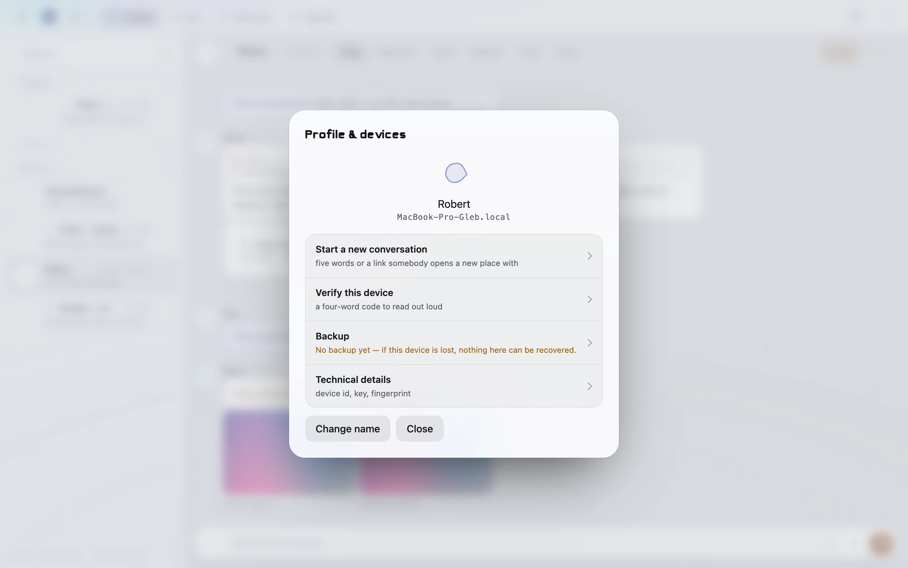
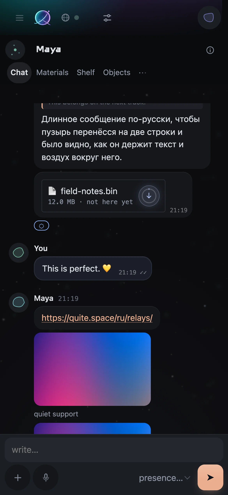

<div align="center">

<picture>
  <source media="(prefers-color-scheme: dark)" srcset="docs/brand/orbit-dark.svg">
  
</picture>

**A quiet place for the people you choose.**

`local-first` · `end-to-end` · `serverless history` · `internet / LAN / LoRa`

[**Download**](#-download) · [What it does](#-what-it-does) ·
[What's new](#-whats-new) · [From source](#-running-it-from-source) ·
[Docs](#-documents) · [Status](#-status) · [quite.space](https://quite.space)

<br>

<picture>
  <source media="(prefers-color-scheme: dark)" srcset="docs/screens/conversation-dark.webp">
  
</picture>

</div>

---

Your conversations live on your own devices, and they travel over whatever
path is available — the internet, a local network, or a LoRa radio. There is
no server holding your history, because there is nowhere for one to sit.

> **Install the client — become a node.**

Under it is the **Terminal Mesh Kernel**: the basic entity is not a chat, a
channel or a profile but a **Terminal** — a cryptographically addressable
thing that can be a person, a shared space, a bot, an AI agent, a sensor, a
gateway, a relay or an archive. A space is one entity whether two people or
twenty are in it; a direct message is a presentation mode, not a data type.

The rule everything else is measured against:

> A Terminal must never appear smarter, more reliable, more human, safer or
> more available than it can prove.

## 📦 Download

**Public beta. The desktop builds are EXPERIMENTAL and are signed by no
authority** — there is no Apple Developer membership and no Debian repository
behind this — so each platform asks you to let the app through once. That is a
deliberate trade, and it is said here rather than hidden.

| | |
|---|---|
| 🍎 **macOS** | [`quite-space-macos-universal.dmg`](../../releases/latest/download/quite-space-macos-universal.dmg) — Apple Silicon and Intel, macOS 13.3+ |
| 🐧 **Linux** | [`quite-space-linux-amd64.deb`](../../releases/latest/download/quite-space-linux-amd64.deb) — Debian 12+ / Ubuntu 22.04+, x86-64 |
| 🤖 **Android** | [`quite-space-android.apk`](../../releases/latest/download/quite-space-android.apk) — Android 7.0+, arm64 |

**macOS.** Drag **Quite Space** to Applications, launch it once — macOS will
refuse and say it cannot verify the developer, which is true — then
**System Settings → Privacy & Security → Open Anyway**. Or:

```sh
xattr -dr com.apple.quarantine "/Applications/Quite Space.app"
```

**Linux.** Install with `apt`, not `dpkg -i` — apt resolves the GTK and WebKit
runtimes:

```sh
sudo apt install ./quite-space-linux-amd64.deb
```

**Android.** Direct install; there is no Play Store listing. Your device will
ask you to allow installing from this source. Every build is signed by the same
key — if an update is ever refused because the signature changed, do not work
around it, tell us instead.

Verify a download against `SHA256SUMS` on the release:

```sh
shasum -a 256 -c SHA256SUMS
```

## ⚡ What it does

- 🏠 **Spaces** — private by default, or public and readable by anyone with
  the link. One entity behind a two-person line, a group and a project room.
- 🗝 **Invitations** that are five spoken words or a link, with an optional
  approval step. No account, no phone number, no directory of people.
- 💬 **Conversation that reads like one** — one column, a face and a name on
  every message, reactions with meanings rather than a sticker drawer,
  replies that say what they answer, and a delivery mark that means a
  machine signed for the bytes, never that somebody looked.
- 🖼 **Media that says where it is.** A photo shows up at once as its signed
  preview; tap it and a small ring turns while the relay is asked, fills as
  the bytes land, and leaves when they are here. No spinner that lies.
- 📜 **Posts** — long-form documents with media, tables and formulas, and an
  optional generative **atmosphere**: a fragment shader and a sound bed
  behind the article, metered frame by frame so it may drift and glow but
  cannot flash. A post opens as itself; Mute, Pause and Leave sit beside it.
- 🔭 **Discover** — catalogues are ordinary public spaces, so anybody can run
  one. Looking inside a space never subscribes you to it.
- 🧭 **A field that never lies** — places, markers, check-ins, and positions
  as signed claims that age honestly in front of you: live, then stale, then
  unknown. The map draws what somebody *stated*, never what it guesses.
- 📻 **Any transport.** An internet relay, a direct LAN link, or a LoRa
  radio, chosen automatically. A relay may introduce people; a LAN may speed
  them up; a radio may keep them talking when the internet is gone. None of
  those transitions creates a new contact or changes what is happening.
- 🌱 **Instruments** — a sensor is a first-class participant with its own
  keys, admitted like anyone else, its readings sealed to their own key
  lineage. An ESP32 SDK speaks the wire byte-for-byte with the Go kernel.
- 🤖 **A local AI terminal** that never leaves the device, when you configure
  a provider for it.

<table>
<tr>
<td width="50%"><br><sub><b>Posts.</b> Long-form documents; a card may carry its own sky.</sub></td>
<td width="50%"><br><sub><b>An article under an atmosphere</b> — a shader behind the words, metered so it can drift and glow but never flash.</sub></td>
</tr>
<tr>
<td><br><sub><b>The field.</b> A route and markers as signed claims; a position that is not fresh says so.</sub></td>
<td><br><sub><b>Light theme, and a sheet.</b> Cool paper, near-black ink, choices as one grouped list.</sub></td>
</tr>
</table>

<p align="center"></p>

The same interface runs in the desktop app, on Android and in a browser tab:
it is one embedded web client, served by your own node on 127.0.0.1.
(Screenshots are taken from a scripted two-node stand —
[`scripts/screens/`](scripts/screens/) — so they can be retaken, not redrawn.)

Encryption is end-to-end per space, with epoch keys rotated on membership
change. Relays are blind and hold nothing: no accounts, no retention beyond a
short TTL, and — for private spaces — no ability to read what passes through.
The exact scope of that claim, including where it does **not** hold, is in
[ADR-016](adr/ADR-016-public-access.md).

## 🛰 What's new

```
$ quite log --releases
  1.0.20   the light shell
  1.0.19   a relay that just answered is not "cooling down"
  1.0.18   tables, formulas, and a long message that opens as a page
  1.0.14   the word leaves at once
  1.0.13   the picture is the control
  1.0.11   the doorbell is real, and the log rides once
  1.0.10   Quiet Signal, a voice of its own
  1.0.7    four skies
```

**1.0.20 — the light shell.** The interface was counted before it was
touched: about twenty-five controls on screen before the first message.
Nothing lost a capability; the release decides what may be *visible at
rest*. One column of messages with a face, a name and a time; actions as a
small toolbar that arrives on hover or tap; the room's bar as one row with
every view a pill; the space's panel as a slide-over instead of a column;
one rounded composer; a neutral, "night sky" palette in both themes, with a
space's own tint as a hue graded by the theme (OKLCH), so every kind of
space is equally bright to the eye — [release notes](docs/releases/1.0.20.md),
and the reasoning in [UI-2](docs/plans/UI-2-LIGHT-SHELL.md).

Since the 1.0 line opened:

- 🚪 **Delivery got honest and fast.** A parked "doorbell" that expects an
  answer, a node that tells its peers "I moved" the moment it changes
  relays, a word that leaves at once instead of on the next tick, and a
  delivery book that sends only what a mailbox does not already hold — one
  relay went from 1270 puts and 48 MB a minute to 62 and 1.7
  ([1.0.11](docs/releases/1.0.11.md), [1.0.14](docs/releases/1.0.14.md)).
- 📊 **Relays say how they are.** A public status endpoint with an
  approximate census computed from salted rotating hashes — never from
  anything a relay could read — shown live at
  [quite.space/relays](https://quite.space/relays/)
  ([the API](docs/RELAY_STATUS_API.md)).
- 🌌 **Atmospheres are shaders now** — nebula, aurora, caustics, silk — under
  one brightness floor ([1.0.7](docs/releases/1.0.7.md)).
- 🔤 **Quiet Signal**, the project's own Latin + Cyrillic display face, built
  from skeletons in [`tools/typeface`](tools/typeface) ([1.0.10](docs/releases/1.0.10.md)).
- 📻 **Instruments without a cable** — a provisioned ESP32 finds the node on
  Wi-Fi, knocks with a signature bound to the node's certificate, and its
  readings arrive with a freshness you can read before the number
  ([1.0.1-rc.1](docs/releases/1.0.1-rc.1.md)).

Every release has its own note in [docs/releases/](docs/releases/README.md),
written for the person who just downloaded it.

## 🖥 Running it from source

```sh
go run ./cmd/terminal ui --passphrase "a passphrase of your own"
```

That is the whole thing: one CGO-free binary that serves the interface on
127.0.0.1 and opens a browser. `terminal node` is the same runtime headless —
on a Raspberry Pi, say. The desktop application is the same node with a window
in front of it:

```sh
cd cmd/desktop && go run .
```

Standing up your own relay, so that your people depend on nobody else's:

```sh
go run ./cmd/terminal-relay --listen :7411
```

## 📚 Documents

| | |
|---|---|
| [docs/guide/](docs/guide/README.md) | the user guide: spaces, invitations, conversation, posts, atmosphere, signals, the Navigator, networking, self-hosting. Russian; an English version follows. |
| [docs/radio/en/](docs/radio/en/README.md) | talking over LoRa: which carrier is proven, flashing an RNode board, attaching one, and the radio tools. [По-русски](docs/radio/README.md). |
| [docs/instruments/](docs/instruments/ESP32.md) | an ESP32 as a citizen: the C core, enrollment, the dev stand. |
| [adr/](adr/README.md) | 37 architecture decision records. The reasoning is there rather than in commit messages. |
| [docs/RELAY_STATUS_API.md](docs/RELAY_STATUS_API.md) | what a relay publishes about itself, and how the census stays blind. |
| [docs/ux/](docs/ux/MEDIA_PRESENCE.md) · [docs/plans/UI-2](docs/plans/UI-2-LIGHT-SHELL.md) | the interface contracts: how media arrives, and why the shell looks the way it does. |
| [VISION_AND_ROADMAP.md](VISION_AND_ROADMAP.md) | the original concept and the first engineering plan, kept as written — with [ENGINEERING_PLAN_M0_M1.md](ENGINEERING_PLAN_M0_M1.md). |

## 🧾 Status

**1.0.x, public beta.** The number is a promise about formats, not about polish:
every log, backup, pass, bundle and device certificate written by this
build opens in every later 1.x. [ADR-033](adr/ADR-033-what-1-0-promises.md)
says exactly what is frozen — and, just as deliberately, what is not (the
loopback HTTP API, the interface, local projections). The beta suffix
marks the reach of our evidence, not a reservation on the formats.

Honest about the edges:

```
  works, in daily use ──── spaces · invitations · conversation · media
                           voice · posts · atmosphere · public spaces
                           catalogues · relays with failover · LAN
                           Android · field sessions
  proven, still young ──── LoRa radio (two boards, no internet, text
                           both ways) · the doorbell for a sleeping
                           phone · the ESP32 instrument SDK
  experimental ─────────── the desktop shell (and both desktop
                           packages are unsigned)
  not built yet ────────── a general multi-hop mesh · group calls
```

- **A limit worth knowing in the field:** a shared position travels one hop.
  Two people on opposite sides of a relay-less segment will see each other
  age to "unknown" rather than appear — honest, but a real edge if you are
  planning around it. The measurement that would widen it is the next
  hardware step ([ADR-031](adr/ADR-031-the-field-is-a-map-of-claims.md)).

## ⚖️ Licence

Two licences, split by what a piece of code *does*:

- **Apache-2.0** — the protocol, schemas, kernel, transports, the relay's wire
  protocol and client, the SDKs and the clients. Everything we want to see
  everywhere: run it, embed it, ship a closed product on top of it, put this on
  a device. The patent grant is explicit.
- **AGPL-3.0-only** — the components an operator stands up so that *other
  people* can use them: `transports/relayserver`, `cmd/terminal-relay` and
  `cmd/quiet-bridge`. Free to run, to modify and to charge for hosting — but
  offer a modified version to users over a network and those users can have
  that version's source.

The relay's server and client live in separate Go packages precisely so that
line can hold; the reasoning, and the directory-by-directory map, is in
[LICENSING.md](LICENSING.md).

Names, logos and the Official Relay / Verified Space marks are granted by
neither licence — see [TRADEMARK_POLICY.md](TRADEMARK_POLICY.md). Fork freely,
under your own name.

Contributing: [CONTRIBUTING.md](CONTRIBUTING.md) ·
Reporting a vulnerability: [SECURITY.md](SECURITY.md)

---

<div align="center">

*the space between us belongs to us*

</div>
